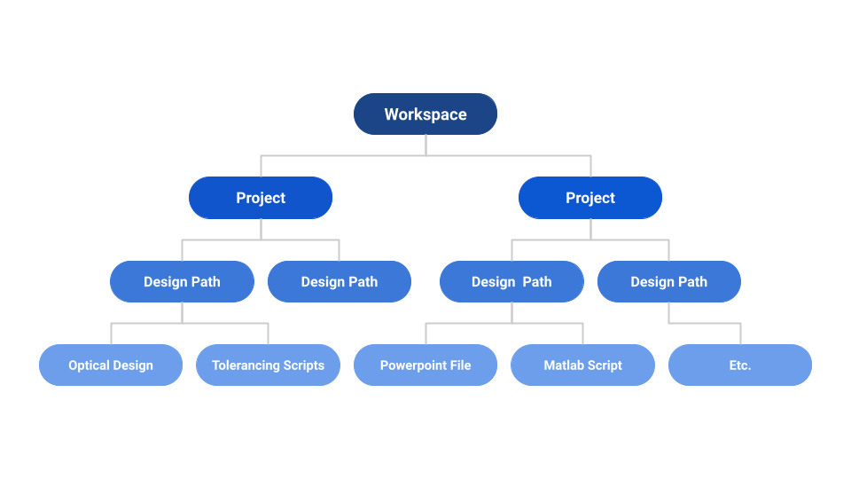

# Spark Documentation

Spark is your personal optical project manager. No more messy file folders, filled with hundreds of 
complex and cryptic optical design file names, no more emailing team members files, and no more
losing track of versions. Spark handles all of that for you, letting you focus on finding success for your optical projects.

## Spark Hierarchy
Spark is made up of several elements that form a hierarchy. At the top is workspaces, which are 
populated with projects, which are groups of design paths, and each design path has assets, which may range from optical
design files and tolerating scripts to simple powerpoints or word documents.

### Workspaces
Spark is built on workspaces. These are shared work areas where you and your team members can 
collaborate and create and proceed through various projects. Spark will allow you to 
assign roles in a workspace, so you can set edit/view/maintainer privileges. 

Currently, everyone in your workspace has the same role and can read, write, and delete everything in a project.
That means **any file that is uploaded can be seen and downloaded by anyone in the workspace**. Similarly, 
any member can delete anything housed in a workspace. Thus, **do not upload
personal or security required documents to Spark!**

### Projects
Projects are the core groups that make up a workspace, and they house **design paths**. A project requires a name, clearly 
indicating the scope of the project, a description, which explains in plain language to another person (or yourself), what the
 project is, and optionally tags and requirements. Tags serve as short-hand descriptors than can be used for filtering and searching
all projects. Requirements are explicit goals and metrics that can be added to the project and are used to reconcile 
all design paths under the project umbrella with the overarching project needs.

### Design Paths
A design path is a clear and distinct design approach that is used to attempt to meet the project goals. Each project may have one or 
multiple design paths, and they can all be thought of as simultaneous exploratory branches to find the best solution to 
your project. You can add new design paths at any time to a project, and you can delete design paths at any point if they
not longer are considered a useful approach for your project. 

Most importantly, **every design path is version controlled**. Anytime that you change or update anything inside a design
path, a new version is created. If you make a mistake or need to go back to a prior version, you can immediately roll back. 
Every version requires a 'commit message', where you explicitly state what the change is, so that yourself and others 
can clearly understand what change happened at every version. What are we changing when we update a design path? The design path 
assets.

Similar to the project creation process, when you create a design path you must define the design path name, and the description 
of the design path. You can also optionally add descriptive tags, which can be used in searching and filtering design paths.

### Assets
Assets are the fundamental components in the Spark hierarchy. They are the files that make up a design path. There is no limit 
on what kind of asset you can upload, but there is one specific type of file that stands out from the rest. Namely, that is 
your optical design file for a design path. Note however, Spark only allows for **1 design file per design path**. Spark has the ability to parse an optical design file1, and will provide key metadata including 
prescription and performance data about your system. This optical metadata is then displayed in a clear and easy to read format on the details page 
of a design path. Further, you can filter and search for a design path based on the parsed metadata of the 
optical design asset in that path! While an optical design asset is unique in Spark, again, you can upload any file asset to a design path.
Any asset you upload can be individually downloaded, or all assets for a design path can be downloaded in bulk. You can 
also upload new assets anytime to your design path, or, you can update existing assets, and it will create a new version (both of that asset and of your design path).

Just like with the project and design paths, when you add an asset, you must define the asset name, the asset description, and you can optionally
 add tags to your asset.

[1] Spark currently is able to parse Zemax optical design files (with the .zmx extension) which have spherical, aspheric, 
and paraxial surfaces. We are always working on expanding file support, and if you upload a file and find we cannot parse it, 
or have a file type you want us to parse, let us know, and we will prioritize adding support for that file type.
