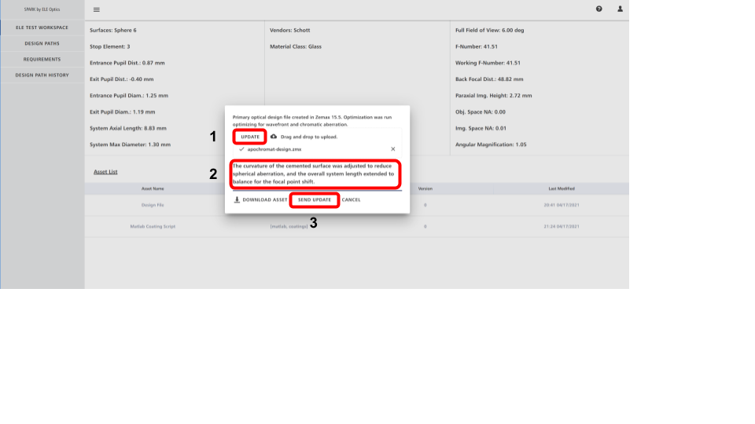

# Getting Started

This guide will explain how to get started using Spark to manage your very own optical projects. We will go through 
creating your first project and design path, and adding assets to that. Next, we will explore 
downloading assets and updating. Finally, we will explore how to select versions and update assets and design paths.

## Your First Project
Let's get started by going through the fundamental creation process in Spark. We will create a project, add a design path to our 
project, and finally upload assets for that design path. Specifically, our design is centered around the idea 
that we are working on a photography lens project with some requirements for low chromatic aberration and 
decent imaging quality. We will create our *Photography Lens* project, and we will add an *Apochromat Doublet* design 
path, which will give us a version controlled branch in our project to iterate through making an Apochromat Doublet that 
best meets our project needs. We will upload our actual (provided to you) optical design for our apochromat doublet. 
This will be a design asset inside our *Apochromatic Doublet* design path. Finally, we will add new files and update our core 
optical design file. Let get started!

### Creating a Project
From the homepage of Spark, we immediately see our workspace, and all (or, if this is your first time logging in, none), of your 
projects in that workspace. To get started on creating a project, click the blue **New Project** card.

Figure 1. Create a new project.

### New Project Information

Figure 2. Fill in new project details.

We should now be at the Project creation page. The first thing we need to do is to document, for ourselves and 
any other collaborators, the name of our Project (1), with a clear, understandable name that describes the primary 
scope of our project. In this example, you can see that the name *Photography Lens* was selected. The next 
required component is the project description section (2), where you must add a short description of your project.
 In this case, I described it as *This project is for an imaging lens for photography of still subjects 25 mm to 500 mm away 
in full daylight*. That way, if I or a collaborator sees the project, we know our rough object distance, the 
general use case, and the spectrum we expect to deal with. You can be more or less detailed, it is up to you, but Spark 
does require a minimum description length. Finally, there is the optional Project Tags area, which are short tags 
that can be added to your project to assist in filtering and searching later on. Note that tags must be comma separated.
Finally, at this point we are technically done with the info needed for a new project, but **hold on**. While 
I indicate the *create* button (3), for this demo we are going to go ahead and create the project, design path, and 
add a design file all at once. Thus, please note that you can absolutely create a project, and then later on add 
a design path separately, simply by clicking create at this point, but this is not what we are going to do right now.

Figure 3. Move on to the design path creation.

### Adding Design Path Information

Figure 4. Fill in design path details.

At this stage we are now going to add the information regarding the new design path we want to create under our 
*Photographic Lens* project umbrella. The process should look familiar, it's the same as the new project information! 
We first will add the Design Path name (1); in this case I knew that my design approach that I wanted to 
explore for the project was an apochromatic doublet, so that was what I named the design path. Next, we again 
must add the details for the Design Path (2), and in this case I described it at *This lens is an all glass apochromat 
design approach which balances imaging performance with chromatic aberration control*. Please note, you can 
always add more design paths later on, but for the time being in this guide we are focused on an apochromatic doublet 
design path. We are now ready to move on to adding our optical design asset to the design path, so lets move ahead by 
clicking the *Add Design Path Files?* dropdown (3).

### Adding Optical Design Asset Information

Figure 5. Add in the details for our optical design file we are going to upload.

At this point we need an optical design file to upload. First, download an apochromat optical design we created for you  here:
[apochromat-optical-design](files/apochromat-design.zmx) (right click and select 'save as').

We are at the final stage for creating our new project, design path, and uploading a design file. We once again will have to 
add the file name (1), which we called *Design File*. Next, we must add the file details (2), which we defined as 
*Primary optical design file created in Zemax 15.5. Optimization was run optimizing for wavefront and chromatic aberration*. As 
before, tags are optional and are comma separated. Lastly, we must upload our file! Click the *UPLOAD FILE* button (or drag and drop) (3), 
and upload the apochromat optical design file we downloaded above.

Figure 6. Upload the optical design file.

If you clicked the upload file button, your computer's file manager will pop up. Navigate to the *apochromat-design.zmx* 
you download and click *open*, as shown in figure 6.

Figure 7. Create the project, design path, and file upload.

We now have added all the information Spark requires, and we can go ahead and click *create*, as shown in figure 7.

### Exploring the Design Path Area

Figure 8. Homescreen with newly added project!

At this point, we will have been returned to Spark's homescreen for your workspace. 
You should see your new *Photographic Lens* project here. Go ahead and click on the project card (encircled with red in figure 8).

Figure 9. Design Path area for the Photographic Lens Project.

On the design path page we are met with a lot of new options, so lets go through each one 
and explain what their function is before we move on.

First, if we want to go back to our primary workspace, we can click on the *[Your Workspace] Workspace* button, 
at the top of the left side navigation bar (a). Next, we mentioned earlier we may want to add another 
design path to our project at some point. This is easy to do, and accomplished simply by clicking the *New Design Path* blue button 
on this page (b). Also, we can see that the **Search and Filter** tool is present on the design path page (
and was present on the workspace page as well). You can type in various filtering parameters and click the *Apply* button (c) 
to filter through the design paths and only select ones that meet your criteria to show on this page. You can 
also search for names and tags of design paths, using the search area and clicking the magnifying glass (d). 
If you want to clear your filters, simply click the reset button.
Finally, we see our first introduction to the **Version Control** aspect of Spark on this page. 
We can see our *Apochromatic Doublet* design path card on this page, and we also see *Version 1 | Updated [Your updated time]*.
This tells us the most recent version of the design path and when it was last updated. If we were to click on this area (e), we would 
be shown the full version list for the design path, along with the version comments for each change 
and the commit time and date. However, for the time being since we haven't created new versions, lets instead 
explore the design path detailed view page. Click on the *Apochromatic Doublet* design path card (circled red in figure 10) to go to the detailed view page.

Figure 10. Select the Apochromatic Doublet design path.

### Exploring the Design Path Details Page

Figure 11. Design Path details page.

We are now viewing the details page for our design path, the *Apochromatic Doublet*. Once again, 
lets explore the new tools we see here before moving on. First, Spark parses your optical 
design files and crates a clean metadata table, showing you the surfaces, materials, and performance of 
the currently selected version of your design path. This lets you quickly take a glance and know 
the performance and general high level concept of the optical design, saving you time and aggravation 
trying to track down that information elsewhere! Second, we can see once again the **Version Control** 
area (a), which if you click on will let you explore the different versions of this design path, roll back to earlier versions, see prior changes, etc. 
A central tenant of Spark is that *everything is version controlled*. So if you make a change and regret it, don't worry! Just roll back to a 
prior version. All the assets will be rolled back, and you can download them and more. 

Next up is the explicit *Tools* area (b). From left to right, we have a button that lets us download all the 
files in the design path onto our local machine (cloud with down arrow). The files will all be placed into a .zip file and downloaded for your use.
 Next, we can add a new file to our design path (page with plus sign). This lets us add new asset files that may become 
essential to our design path, such as scripts, tolerancing files, powerpoints, or whatever else you find is a key component of the design path.
 To reiterate, every file you add will be version controlled.

Lets go ahead and add a new file to our design path. First, we will select the *Add File* button (encircled with red in figure 12.)

Figure 12. Add a new file to the design path.

This will take us to the new file page (figure 13), which you may notice looks familiar.

Figure 13. New file upload details.

On this page, just as before, we must add a file name (1) for the file we are uploading, a description of the uploaded file (2), 
and then we must upload a file, which can be done by dragging and dropping your file or clicking the 
*Upload File* button (3). Please feel free to upload any file at this point, I chose a custom Matlab script that was used
for optimizing the apochromat, but any file will do. Once uploaded, go ahead and click the *Create* button (4).

We will now be taken back to the design path details page, and if you click on the *Version Control** area (marked 'a' in figure 11), then you should 
see a new version of your design path, with a comment explaining a new file was added. Success! Go ahead and click that new version
and you will now see your design path details page, showing two assets in the asset area at the bottom; your design file, and the new file you uploaded.

Figure 14. A new asset has been added to the design path, and the next step is to update an asset.

We can now go ahead and get to the exciting part, updating an asset! First, we once again will need to have an updated optical 
design file to upload. So, go ahead and download the updated version of the apochromat design file here: 
[apochromat-optical-design-update](files/apochromat-design-updated.zmx) (right click and select 'save as').

Now, we are all set to update our file. Go ahead and select your existing optical design file(encircled red in figure 14).

Figure 15. Updating an asset.

This will have opened an update dialog, shown in Figure 15. This dialog we will note lets you download your asset as an individual 
file as well as update it, in case you didn't want to download all files in your design path. However, 
we are here to update our asset. First, click the update button to upload a new version of your optical design file (1).
Why not try downloading the file using the download button, opening your optical design apochromat in Zemax, changing a thickness, curvature, glass, etc., save it, and then 
we can upload it here! Once you have uploaded your updated design file, you need to add a description to explain what changes were made (2).
Once that is done, we are ready to send the update! Go ahead and click the *Send Update* button (3), and you will be returned to the design path details page.

If you again click on the version control tool (area 'a' in figure 11), you will see a new version 
of your design path that describes the update you just made. Go ahead and click it!

Figure 16. New design path version, showing optical design performance (and changes).

We now will see the newest version of our design path. A few things will stand out to you. First, the version area has changed, 
and accurately reflects when the update was made. The *Design File* in the *Asset List* also shows that there is more than one version now,
 and will list the new *Last Updated* time. Most importantly, we can see that the metadata has changed, and that the difference in the 
optical design metadata from the prior version is now shown in light blue, next to the current metadata. This light blue text shows 
**the change** in performance between the optical design versions. 

One final thing to note before we conclude this guide. If you do make an error or want to go back to see some earlier version of a file or your design, 
just go ahead and click on the version area, and you will be taken to the version selection panel, where you can roll back to whatever stage you want.

## Conclusion
In this guide you learned how to take some existing optical design file you have, and import it into the Spark framework, to make
 your optical design work easier for you! You created a project to house all of your design approaches, you created 
a design path for your existing optical design file, and finally you uploaded your optical design file. Spark lets you 
filter and sort through all of your projects and design paths to rapidly and easily find exactly the thing you are looking 
for, without digging through endless folders. You also saw on the design path details page that Spark parses your optical design file 
and shows you a clean and easy to read metadata table, allowing you to rapidly and easily asses the current state of the optical design.

Next, we added new asset files to your design path, and we updated our optical design file. 
We saw that when we added or updated a file, the design path created a new version. This lets us rollback if we 
ever need to, to view, download, or explore earlier versions of the design path and files in it. We also saw 
that Spark shows the change between optical design file version in the metadata area, to let you 
quickly see how your optical design has changed since last time. Finally, we saw how you can download all or only one of your 
assets in your design path to allow you to work on them on your own local machine (just be sure to push your new great changes to Spark when you are done!).

